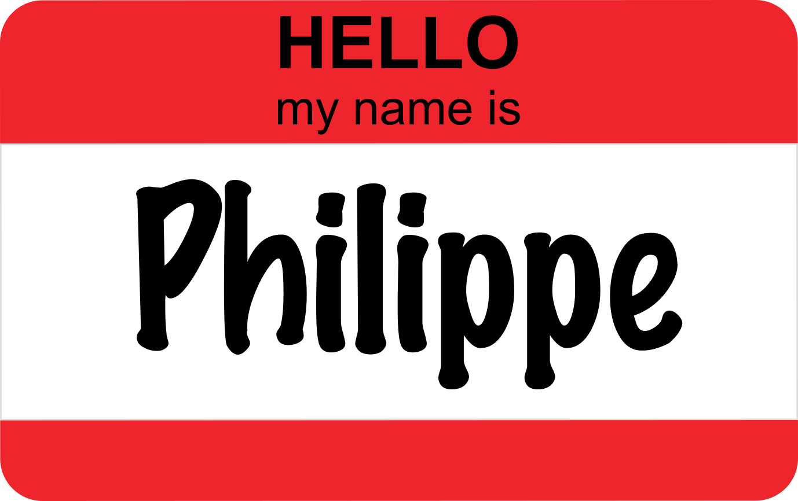

<!-- https://evamaerey.github.io/flipbooks/flipbook_recipes#49 -->

```{r setup, include=FALSE}
knitr::opts_chunk$set(
  echo = TRUE,
  dev = "svg",
  message = FALSE,
  cache = TRUE,
  fig.align = "center",
  fig.height = 4
)
options(htmltools.dir.version = FALSE)
# names(xaringan:::list_css())

# devtools::install_github("rstudio/fontawesome")
library(tidyverse)
library(ggpmthemes)
library(patchwork)
library(flipbookr)
library(fontawesome)

theme_set(theme_poppins())

htmltools::tagList(rmarkdown::html_dependency_font_awesome())
```

```{r xaringanExtra, echo=FALSE}
xaringanExtra::use_xaringan_extra(
  c(
    "tile_view",
    "animate_css",
    "tachyons"
  )
)
xaringanExtra::use_broadcast()
# xaringanExtra::use_clipboard()
# xaringanExtra::use_share_again()

```

```{r xaringanExtra-clipboard, echo=FALSE}
htmltools::tagList(
  xaringanExtra::use_clipboard(
    button_text = "Copy</i>",
    success_text = "<i class=\"fa fa-check\" style=\"color: #90BE6D\"></i>",
    error_text = "<i class=\"fa fa-times-circle\" style=\"color: #F94144\"></i>"
  ),
  rmarkdown::html_dependency_font_awesome()
)
```

```{r xaringan-animate-all, echo=FALSE}
# xaringanExtra::use_animate_all("fade")
xaringanExtra::use_tachyons()
# xaringanExtra::use_text_poster()
```

class: title-slide, center, bottom

# `r rmarkdown::metadata$title`

### *`r rmarkdown::metadata$subtitle`*


February 4, 2021 (updated: `r Sys.Date()`)

## `r rmarkdown::metadata$author`

---

<br>

<center></center>

<p align="left">

<b>Research assistant at Takuvik (remote sensing, modeling, data science)</b><br>

- Using R more than 10 years<br>
- Author of 3 packages on CRAN<br>
- R blog: www.pmassicotte.com<br>

<br>

<i class="fab fa-github"></i> https://github.com/PMassicotte <br>
<i class="far fa-envelope"></i> philippe.massicotte@takuvik.ulaval.ca <br>
<i class="fab fa-twitter"></i> @philmassicotte

</p>

---

class: inverse-two, center, middle

# Ateliers gestion et archivage des données

<br>
<center>
<figure>
  
</figure>
</center>

<br>

### 18, 22 et 25 mars 2021

---

# Outline

- What is data visualization?

- `ggplot2` basic plots
    * Histograms and bar plots
    * Points and lines plots
    * Boxplots

- `ggplot2` aesthetics and appearance
    * Color, size
    * Axes and titles
    * Faceting

- Overview of the `theme()` function

- Combining plots with `patchwork`

---

# Data visualization

<center>
<figure>
  
<figcaption>Artwork by <a href="https://twitter.com/allison_horst?s=20">@allison_horst</a></figcaption>
</figure>
</center>

---

# Data visualization

--

- Important aspect of data sciences
    - <span class="gradient-underline">Communicate information clearly and efficiently to the community.</span>

--

- Powerful tool to discovers patterns in the data.

--

- It makes complex data more accessible -> **reveal data**.

--

- Bad graphics can be a reason for paper rejection.
    - <span class="gradient-underline">Readers should rapidly understand the message you are trying to convey.</span>

--

- A picture is worth a thousand words.
    - <span class="gradient-underline">Always, always, always plot your data!</span>
    - When possible, replace tables with more compelling figures.

---

# The Anscombe data

.gradient-underline[These four datasets have the same statistical properties (*mean*, *variance*, *correlation*). However, they look quite different.]

```{r, echo = FALSE}
anscombe %>%
  pivot_longer(everything(),
    names_to = c(".value", "set"),
    names_pattern = "(.)(.)"
  ) %>%
  mutate(set = as.character(as.roman(set))) %>%
  ggplot(aes(x = x, y = y)) +
  geom_point() +
  facet_wrap(~set) +
  geom_smooth(method = "lm", se = FALSE, color = "#577590") +
  theme(
    panel.border = element_blank(),
    strip.background = element_blank(),
    strip.text = element_text(
      size = 20,
      face = "bold",
      family = "Quattrocento",
      color = "gray75"
    ),
    axis.title = element_blank(),
    axis.ticks = element_blank()
  )

```

---

# Different types of visualizations

There are many types of visualization to chose from to present data. The decision depends on the data itself and how you want to present it to your audience.

<center>
    
    <figcaption>
    <a href="https://phys.org/news/2013-10-visualization.html">What makes a data visualization memorable?</a>
    </figcaption>
</center>

---

class: inverse, center, middle

<center>
<figure>
  
<figcaption>Artwork by <a href="https://twitter.com/allison_horst?s=20">@allison_horst</a></figcaption>
</figure>
</center>

---

# ggplot2

`ggplot2` is a system for declaratively creating graphics, based on [The Grammar of Graphics](https://amzn.to/2ef1eWp).

.left-column[
<center>
<figure>
  
</figure>
</center>
]

.right-column[
`ggplot2` is not part of base R, so it needs to be installed.

```{r, eval = FALSE}
install.packages("ggplot2")
```

After the installation, you will have to load it.

```{r, eval = FALSE}
library(ggplot2)
```
]

---

# ggplot2

.column-left[
`ggplot2` is a very powerful tool. The learning curve can be difficult, but the time investment will eventually pay off.
]

.column-right[
<center>
<figure>
  
    <figcaption>
    Artwork by <a href="https://twitter.com/allison_horst?s=20">@allison_horst</a>
    </figcaption>
</figure>
</center>
]

---

# TidyTuesday

TidyTuesday is a weekly challenge where people use (mostly) `ggplot2` to explore a new dataset.

> A weekly data project aimed at the R ecosystem. As this project was borne out of the R4DS Online Learning Community and the R for Data Science textbook, an emphasis was placed on understanding how to summarize and arrange data to make meaningful charts with `ggplot2`, `tidyr`, `dplyr`, and other tools in the `tidyverse` ecosystem.

<center>
    
    <figcaption>
    <a href="https://twitter.com/search?q=%23TidyTuesday&src=hashtag_click">#TidyTuesday on <i class="fab fa-twitter"></i></a>
    </figcaption>
</center>

---

# TidyTuesday

As already said, `ggplot2` can be intimidating at first. However, with some practice, you will be able to make stunning graphics.

<div class="row">
    <div class="column">
        
        <figcaption>
            Graphic by <a href=https://twitter.com/ChBurkhart">@ChBurkhart</a>
        </figcaption>
    </div>
    <div class="column">
        
        <figcaption>
            Graphic by <a href=https://twitter.com/jakekaupp">@jakekaupp</a>
        </figcaption>
    </div>
    <div class="column">
        
        <figcaption>
            Graphic by <a href=https://twitter.com/geokaramanis?lang=en">@geokaramanis</a>
        </figcaption>
    </div>
</div>

<span class="gradient-underline">Most people participating in the TidyTuesday challenges share their code on Github. It is a great way to learn more advanced techniques!</span>

---

class: inverse, center, middle

# Let's start with ggplot2!

---

# The data

For the following examples, we are going to use the data from the `mpg` dataset. This dataset contains a subset of the [fuel economy data](http://fueleconomy.gov) from the EPA. 

```{r, echo = FALSE}
mpg %>%
  head(50) %>%
  rmarkdown::paged_table(options = list(rows.print = 7))
```

---

# The data

It should be noted that `ggplot2` package operates on R `data.frame`.

```{r}
str(mpg)
```

---

# Understanding the ggplot2 syntax

A `ggplot2` plot is built layer by layer by using the `+` operator. 

<center>
    
</center>
<figcaption>
    The basic structure of a ggplot2 plot.
</figcaption>
        
---

# The geoms 

`geoms` is the abbreviation for *geometric objects* which are used to specify which type of graphic you want to produce (boxplot, barplot, scatter, ...). All `ggplot2` geoms start with the `geom_` prefix.

<small>
```{r, echo = FALSE}
ls(pattern = "^geom_", env = as.environment("package:ggplot2"))
```
</small>

---

class: inverse, center, middle

# One variable graphics

---

# One variable graphics

In this section, we are going to see the two main types of one variable graphics:

| **Graphic type** | **Geom**           | **Description**                          |
| ---------------- | ------------------ | ---------------------------------------- |
| Histogram        | `geom_histogram()` | Produces histograms for continuous data. |
| Barplot          | `geom_bar()`       | Produces histograms for discrete data.   |


```{r histogram1, include = FALSE}
ggplot(
  data = mpg,
  mapping = aes(x = cty)
) +
  geom_histogram()
```

---

`r chunk_reveal(chunk_name = "histogram1", title = "# Histogram")`

---

```{r barplot1, include=FALSE}
ggplot(
  data = mpg,
  mapping = aes(x = class)
) +
  geom_bar()
```

`r chunk_reveal(chunk_name = "barplot1", title = "# Barplot")`

---

class: inverse, center, middle

# Two variables graphics

---

# Two variables graphics

There are several types of charts with two variables. Here are the most used.

| **Graphic type** | **Geom**         | **Description**                                               |
| ---------------- | ---------------- | ------------------------------------------------------------- |
| Barplot          | `geom_col()`     | Produces bars with heights that represent values in the data. |
| Scatter plot     | `geom_point()`   | Produces scatter plot between `x` and `y`.                    |
| Line plot        | `geom_line()`    | Produces line plot between `x` and `y`.                       |
| Boxplot          | `geom_boxplot()` | Boxplot between `x` and `y`.                                  |

---

# Barplot

We used `geom_bar()` to visualize the number/count of cases for each value of `x`. If we want to represent values in the data (`y`), we can use `geom_col()`. For this example, I will use the `starwars` data that is included in the `dplyr` package. .gradient-underline[This graph shows the top 20 tallest characters (in cm).]

```{r, echo=FALSE}
sw <- starwars %>% 
  slice_max(height, n =  20)
```

.pull-left[
```{r barplot2, eval=FALSE}
ggplot(
  data = sw,
  mapping = aes(
    x = name,    #<<
    y = height   #<<
  )
) +
  geom_col()
```
]

.pull-right[
```{r ref.label="barplot2", echo=FALSE}

```
]

--

**What is wrong with this graph?**

---

# Barplot

In the previous graph, it was difficult to read the names on the `x` axis. .gradient-underline[A better way to present the data is by swapping the `x` and `y` axes.]

--

.pull-left[
```{r barplot3, eval=FALSE}
ggplot(
  data = sw,
  mapping = aes(
    x = height,  #<<
    y = name     #<<
  )
) +
  geom_col()
```
]

.pull-right[
```{r ref.label="barplot3", echo=FALSE}

```
]

---

# Ordering things

We have made some improvements in the previous graph by swapping the axes. However, .gradient-underline[it would be even better if the characters were sorted by their height] to make the plot easier to understand. 

--

One way to do it is with `forcats::fct_reorder()`. Note that the `forcats` library is not part of base R and must be installed separately.

--

.pull-left[
<small>
```{r barplot4, eval=FALSE}
ggplot(
  data = sw,
  mapping = aes(
    x = height,
    y = forcats::fct_reorder(name, height)  #<<
  )
) +
  geom_col()
```
</small>
]

--

.pull-right[
```{r ref.label="barplot4", echo=FALSE}

```
]

---

```{r scatterplot1, include = FALSE}
ggplot(mpg, aes(x = displ, y = hwy)) +
  geom_point()
```

`r chunk_reveal(chunk_name = "scatterplot1", title = "# Scatter plot")`

---

```{r lineplot1, include = FALSE}
ggplot(mpg, aes(x = displ, y = hwy)) +
  geom_line()
```

`r chunk_reveal(chunk_name = "lineplot1", title = "# Line plot")`

---

# Boxplot

> In descriptive statistics, a box plot or boxplot is a convenient way of graphically depicting groups of numerical data through their quartiles (Wikipedia).

To make a boxplot, we need to have a **discrete/categorical** variable on `x` and a **continuous** variable on `y`.

---

```{r boxplot1, include = FALSE}
ggplot(
  data = mpg,
  mapping = aes(x = class, y = cty)
) +
  geom_boxplot()
```

`r chunk_reveal(chunk_name = "boxplot1", title = "# Boxplot")`

---

class: inverse, center, middle

# Geom aesthetics

---

# Geom aesthetics

Aesthetics such as *color*, *shape*, *size* of the displayed geoms can be controlled inside the `geom_()` functions. For example, we can change the `color` and the `size` of the point in the `geom_point()` function.

```{r eval = FALSE}
geom_point(color = "red", size = 10)
```

```{r, echo = FALSE, fig.height = 3.5, fig.width = 6}
mpg %>%
  ggplot(aes(x = displ, y = cty)) +
  geom_point(color = "red", size = 10)
```

---

# Working with colors

If we want to set a specific color, we have to set it outside the aesthetic: `geom_point(color = "orange")`.

```{r, fig.height = 3.5}
ggplot(mpg, aes(x = displ, y = hwy)) +
  geom_point(color = "orange") #<<
```

---

# Working with colors

If we want to set a color based on a variable, we have to use the aesthetic: `aes(colour = variable)`.

```{r, fig.height = 3.5}
ggplot(mpg, aes(x = displ, y = hwy)) +
  geom_point(aes(color = class)) #<<
```

---

# Setting colors manually

By default, `ggplot2` uses a default color palette.

```{r, fig.height = 3.5}
p <- ggplot(mpg, aes(x = displ, y = hwy)) +
  geom_point(aes(color = drv))

p
```

---

```{r manual_colors1, include = FALSE}
p +
  scale_color_manual(
    breaks = c("4", "f", "r"),
    values = c(
      "orange",
      "#CB2955",
      "blue"
    ),
    labels = c(
      "Front wheel drive",
      "Rear wheel drive",
      "4wd"
    )
  )
```

`r chunk_reveal(chunk_name = "manual_colors1", title = "# Setting colors manually \n We can also create our own palette of colors using *scale_color_manual()*.")`

---
background-image: url(https://github.com/EmilHvitfeldt/paletteer/blob/master/man/figures/logo.png?raw=true)
background-size: 90px
background-position: 90% 8%

# Color palettes for ggplot2

`paletteer` is a comprehensive collection of color palettes in R created by [@Emil_Hvitfeldt](https://twitter.com/Emil_Hvitfeldt). I have made a [paletteer gallery](https://github.com/PMassicotte/paletteer_gallery) to help me navigate all the palettes.

.pull-left[

<small>
```{r paletteer, eval=FALSE}
library(paletteer) #<<

ggplot(
  data = sw,
  mapping = aes(
    x = height,
    y = forcats::fct_reorder(name, height),
    fill = height #<<
  )
) +
  geom_col() +
  scale_fill_paletteer_c("ggthemes::Red-Gold") #<<
```
</small>
]

.pull-right[
```{r ref.label="paletteer", echo=FALSE}

```
]

---

# Types of color scales

.gradient-underline[Attention to the type of color scale that is mapped to your data.]

--

- Use `scale_color_*()` of `scale_colour_*()` for the .gradient-underline[color] of the geom.

--

- Use `scale_fill_*()` for the .gradient-underline[fill color] of the geom.

--

.pull-left[

<br>

```{r color-vs-fill, eval=FALSE}
ggplot(
  data = mpg,
  mapping = aes(x = class)
) +
  geom_bar(
    size = 2,
    aes(fill = fl, color = class) #<<
  )
```
]

.pull-right[

```{r, echo=FALSE, ref.label="color-vs-fill", out.height="80%"}

```
]

---

# Working with size

As we did for the colors, the size of the geom (ex.: dots) can be based on a particular variable.

```{r, fig.height = 3.5}
ggplot(mpg, aes(x = displ, y = hwy)) +
  geom_point(aes(size = cyl)) #<<
```

---

# Continuous vs discrete mapping

.gradient-underline[Pay attention to the type of data you are mapping to a color or shape scale.]

**If the mapped variable is .gradient-underline[continuous], the generated guide on the legend will be also .gradient-underline[continuous].**

.pull-left[
<br>
```{r continuous-mapping, eval=FALSE}
ggplot(mpg, aes(x = displ, y = hwy)) +
  geom_point(aes(color = year)) #<<
```
]

.pull-right[

```{r, echo=FALSE, ref.label="continuous-mapping", out.height="100%"}

```
]

---

# Continuous vs discrete mapping

.gradient-underline[Pay attention to the type of data you are mapping to a color or shape scale.]

**If the mapped variable is .gradient-underline[discrete], the generated guide on the legend will be also .gradient-underline[discrete].**

.pull-left[
<br>
```{r discrete-mapping, eval=FALSE}
ggplot(mpg, aes(x = displ, y = hwy)) +
  geom_point(aes(color = factor(year))) #<<
```
]

.pull-right[

```{r, echo=FALSE, ref.label="discrete-mapping", out.height="100%"}

```
]

---

class: inverse, center, middle

# Axes and titles

---

# Axes and titles

There are many ways to change the titles of the graphic and the axes. Here we are going to use the `labs()` function. 

These are the main parameters:

- `title`: Main title of the graph

- `x`, `y`: Titles for the axes

- `subtitle`: Subtitle title of the graph (default: under the main title)

- `caption`: Caption of the graph (default: bottom right of the graph)

---

```{r, axes_and_titles1, include = FALSE}
ggplot(
  mpg,
  aes(x = displ, y = cty)
) +
  geom_point() +
  labs(
    title = "Car fuel economy",
    subtitle = "Data from 1999 to 2008 for 38 popular models of cars",
    caption = "Data from: https://fueleconomy.gov/",
    x = "Engine displacement (L)",
    y = "City miles per gallon"
  )
```

`r chunk_reveal(chunk_name = "axes_and_titles1", title = "# Axes and titles")`

---

```{r, axes_and_titles2, include = FALSE}
ggplot(
  mpg,
  aes(x = displ, y = cty)
) +
  geom_point() +
  scale_x_continuous(
    breaks = c(3, 6),
    labels = c("Three", "Six")
  )
```

`r chunk_reveal(chunk_name = "axes_and_titles2", title = "# Controling axis labels")`

---

class: inverse, center, middle

# Faceting

---

# Faceting

Faceting is a technique that allows displaying additional categorical variables in facets. Within `ggplot2`, there are two types of faceting: `facet_grid()` and `facet_wrap()`.

<center>
<figure>
  
  <figcaption>
    Small multiple graphs can be useful to visualize data divided into smaller subsets. 
</figcaption>
</figure>
</center>

---

```{r, facet1, include = FALSE}
ggplot(
  mpg,
  aes(x = displ, y = cty)
) +
  geom_point() +
  facet_wrap(~class)
```

`r chunk_reveal(chunk_name = "facet1", title = "# 1D faceting")`

---

```{r, facet2, include = FALSE}
ggplot(
  mpg,
  aes(x = displ, y = cty)
) +
  geom_point() +
  facet_wrap(~class, scales = "free")
```

`r chunk_reveal(chunk_name = "facet2", title = "# 1D faceting")`

---

```{r, facet3, include = FALSE}
ggplot(
  mpg,
  aes(x = cty)
) +
  geom_histogram() +
  facet_grid(cyl ~ class)
```

`r chunk_reveal(chunk_name = "facet3", title = "# 2D faceting")`

---

class: inverse, center, middle

# Saving your graphics

<br>

.pull-left[`r fontawesome::fa("file-image", fill = "#9EADBD", height = 250)`]
.pull-right[`r fontawesome::fa("file-pdf", fill = "#C39AAC", height = 250)`]

---

# Saving your graphics

Saving `ggplot2` graphics is done with the `ggsave()` function.

```{r, eval = FALSE}
p <- ggplot(mpg, aes(x = displ, y = cty)) +
  geom_point()
```

**Vector formats**

```{r, eval=FALSE}
ggsave("path/to/myfile.pdf", p, width = 5.97, height = 4.79)
ggsave("path/to/myfile.eps", p, width = 5.97, height = 4.79)
ggsave("path/to/myfile.ps", p, width = 5.97, height = 4.79)
```

**Raster formats**

```{r, eval=FALSE}
ggsave("path/to/myfile.jpg", p, width = 5.97, height = 4.79, dpi = 300)
ggsave("path/to/myfile.tiff", p, width = 5.97, height = 4.79, dpi = 300)
ggsave("path/to/myfile.png", p, width = 5.97, height = 4.79, dpi = 300)
```

---

# Vector vs raster graphics

.pull-left[
> The main difference between vector and raster graphics is that raster graphics are composed of pixels, while vector graphics are composed of paths.
.left[
<credit>
    Source: <a href="https://www.geeksforgeeks.org/vector-vs-raster-graphics/">Vector vs Raster Graphics</a>
</credit>
]

- Scientific journals often require 300 DPI raster or vector graphics.

- .gradient-underline[Attention: vector graphics can produce very large files for certain types of graphics (ex.: 3D plots).]

]

.pull-right[
<center>
<figure>
  
  <figcaption>
    Source: Wikipedia 
</figcaption>
</figure>
</center>
]

---

class: inverse, center, middle

# Using ggplot2 themes

---

# `ggplot2` themes

> Themes are a powerful way to customize the non-data components of your plots: i.e. titles, labels, fonts, background, gridlines, and legends.

Many components can be changed using the `theme()` function. Today we are going to see just a few of them, but feel free to have a look at `?theme` to have more information.

--

`theme()` can be used to modify:

--

- The background aesthetics (color, grid, etc.).

--

- Axis titles and ticks aesthetics.

--

- Legend titles and positions.

--

- Aesthetics of plot titles (title, subtitle, caption, etc.).

--

- Plot margins.

---

```{r, theme1, include = FALSE}
p +
  theme_bw() +
  theme_light() +
  theme_gray() +
  theme_dark() +
  theme_void()
```

`r chunk_reveal(chunk_name = "theme1", title = "# Built in themes")`

---

```{r, theme2, include = FALSE}
p +
  ggthemes::theme_solarized() +
  ggthemes::theme_fivethirtyeight() +
  ggthemes::theme_calc() +
  ggthemes::theme_excel() +
  ggpubr::theme_pubr() +
  ggpubr::theme_cleveland() +
  ggpubr::theme_pubclean()
```

`r chunk_reveal(chunk_name = "theme2", title = "# External themes")`

---

```{r, legend_position, include = FALSE}
p +
  theme(legend.position = "top") +
  theme(legend.position = "left") +
  theme(legend.position = "bottom")
```

`r chunk_reveal(chunk_name = "legend_position", title = "# Legend position")`

---

```{r, grid, include = FALSE}
p +
  theme(
    panel.grid = element_line(
      size = 3,
      color = "red"
    )
  )
```

`r chunk_reveal(chunk_name = "grid", title = "# Grid")`

---

```{r, ticks, include = FALSE}
p +
  theme(
    axis.ticks = element_line(
      size = 2,
      color = "blue"
    ),
    axis.ticks.length = unit(1, "cm")
  )
```

`r chunk_reveal(chunk_name = "ticks", title = "# Axes ticks")`

---

class: inverse, center, middle

<center>
<figure>
  
<figcaption>
    Artwork by <a href="https://twitter.com/allison_horst?s=20">@allison_horst</a>
</figcaption>
</figure>
</center>

---

# Combining plots

There are many R packages that cab be used to combine plots.  Here we are going to have a quick overview of the `patchwork` package. The package is not part of base R so it needs to be installed and loaded before you can use it.

```{r, eval = FALSE}
install.packages("patchwork")

library(patchwork)
```

<center>
<figure>
  
  <figcaption>
    <a href="https://github.com/thomasp85/patchwork">The patchwork package</a>
</figcaption>
</figure>
</center>

---

# Combining plots

First, let's make some plots. We are going to use a dataset about [alcohol use by country](https://datahub.io/five-thirty-eight/alcohol-consumption/r/0.html). It is a dataset containing 193 rows and 5 columns. Here is a preview of the data.

```{r, echo = FALSE}
df <- read_csv(here::here("data", "raw", "drinks_csv.csv"))

df %>%
  rmarkdown::paged_table(options = list(rows.print = 7))
```

---

# Overview of the data

The data description is as follows:

- `country`: Name of the country

- `beer_servings`: Average number of beer servings per capita

- `spirit_servings`: 	Average number of spirit servings per capita

- `wine_servings`: 	Average number of wine servings per capita

- `total_litres_of_pure_alcohol`: Average quantity of pure alcohol consumed per capita 

---

# Let's make a plot

This graph shows the top 10 countries with the highest average quantity of pure alcohol consumed.

```{r, echo = FALSE}
df_viz <- df %>%
  top_n(total_litres_of_pure_alcohol, n = 10) %>%
  pivot_longer(
    -c(country, total_litres_of_pure_alcohol),
    names_to = "serving_type",
    values_to = "serving_quantity"
  )
```

```{r, echo = FALSE}
p1 <- df_viz %>%
  mutate(
    country = fct_reorder(country, total_litres_of_pure_alcohol)
  ) %>%
  ggplot(aes(x = total_litres_of_pure_alcohol, y = country)) +
  geom_col() +
  labs(
    x = "Average quantity of pure alcohol\nconsumed per capita (liters)",
    y = NULL
  )
```

```{r}
p1
```

---

# Let's make another plot

This graph shows the type of servings for the top 10 countries with the highest average quantity of pure alcohol consumed.

```{r, echo = FALSE}
p2 <- df_viz %>%
  mutate(
    country = fct_reorder(country, total_litres_of_pure_alcohol)
  ) %>%
  ggplot(aes(x = serving_quantity, y = country, fill = serving_type)) +
  geom_col() +
  labs(
    x = "Average number of servings",
    y = NULL
  ) +
  scale_fill_viridis_d(
    breaks = c("beer_servings", "spirit_servings", "wine_servings"),
    labels = c("Beer", "Spirit", "Wine")
  ) +
  theme(
    legend.title = element_blank()
  )
```

```{r}
p2
```

---

# Combining horizontally

```{r, fig.width = 10}
p1 + p2
```

---

# Combining vertically

```{r, fig.width = 7}
p1 / p2
```

---

# More complex arrangement

```{r, fig.width = 10, out.width="100%"}
(p1 + p2) / p1
```

---

# Adding labels

.pull-left[
It is often interesting to add a title and necessary to identify each panel (graph) with a letter. This can be achieved with the `plot_annotation()`.

```{r, plot-annotation1, eval=FALSE}
p1 / p2 +
  plot_annotation(
    tag_levels = "A", #<<
    title = "World alcohol consumption" #<<
  )
```
]

.pull-right[
```{r, plot-annotation2, fig.height=6, eval=TRUE, ref.label="plot-annotation1", echo=FALSE}
```
]

---

# A final note...

There is a lot to learn about `ggplot2` and data visualization, but I hope you have learned something today.

--

If it is not the case...

--

<div class="row">
    <div class="column">
        
    </div>
    <div class="column">
        
    </div>
    <div class="column">
        
    </div>
</div>
